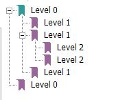

# PdfTOC utility
[](https://github.com/vb64/pdftoc/actions?query=workflow%3A%22pdftoc+pep257%22)
[](https://github.com/vb64/pdftoc/actions?query=workflow%3A%22pdftoc+tests%22)
[](https://www.codacy.com/gh/vb64/pdftoc/dashboard?utm_source=github.com&amp;utm_medium=referral&amp;utm_content=vb64/pdftoc&amp;utm_campaign=Badge_Grade)
[](https://www.codacy.com/gh/vb64/pdftoc/dashboard?utm_source=github.com&utm_medium=referral&utm_content=vb64/pdftoc&utm_campaign=Badge_Coverage)

Merging several pdf files and generate hierarchy TOC for the resulting pdf. TOC and set of source pdf files are defining in JSON file.

Usage:
```bash
pdftoc toc.json
```

For example, to produce resulting `build/output/Merged report.pdf` file from `fixtures/example.pdf` with hierarchical TOC:



Use the following `toc.json` file:

```json
{
  "target": "build/output/Merged report.pdf",
  "folder": "fixtures",
  "toc": [
    ["Level 0", "", [
      ["Level 1", "{f}example.pdf", []],
      ["Level 1", "{f}example.pdf", [
        ["Level 2", "{f}example.pdf", []],
        ["Level 2", "{f}example.pdf", []]
      ]],
      ["Level 1", "{f}example.pdf", []]
    ]],
    ["Level 0", "{f}example.pdf", []]
  ]
}
```

Sequence "{f}" is optional placeholder. It will be replaced with the value of "folder" key ('fixtures' in the given example).

If you want to align sections borders in resulting pdf on an even number of pages (for example when printing hard copy), you can use `evenpages` key in json file.

```json
{
  "target": "Merged_report.pdf",
  "evenpages": 1,
```

You can download the ready [win64 binary executable](https://github.com/vb64/pdftoc/releases/download/v.1.1/pdftoc.exe) or create your version from sources.

Download and install:

- [Python 3](https://www.python.org/downloads/release/python-3810/)
- GNU [Unix Utils](http://unxutils.sourceforge.net/) for makefile operation

Then

```bash
git clone git@github.com:vb64/pdftoc.git
cd pdftoc
make setup PYTHON_BIN=/path/to/python3/executable
make tests
make exe
```

`pdftoc.exe` will be created in `dist` subfolder.
